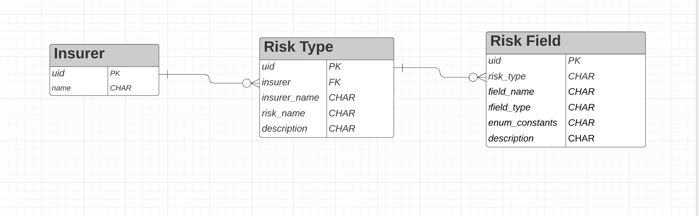

# BriteCore test backend

This app is hosted at [https://u7mkplvlga.execute-api.us-west-2.amazonaws.com/dev/api/](https://u7mkplvlga.execute-api.us-west-2.amazonaws.com/dev/api/)

Deployed with `Zappa`. Settings at `src/zappa_settings.json`.

## Dependencies
- Python 3.8.x
- Django Rest Framework 0.1.0
- Django 3.7.7 see `requirements.txt` for more

## Deliverables

**Data**
- ORM class file at `src/insurer/models.py`
- Entity Relationship Diagram 
    

**Backend**
- APIs

    - Get a single risk type
    
        Send a GET request to this endpoint with risktype `uid` 
        
        ```
        https://u7mkplvlga.execute-api.us-west-2.amazonaws.com/dev/api/risktype/{uid}/
        ```

        For example:
        ```
         https://u7mkplvlga.execute-api.us-west-2.amazonaws.com/dev/api/risktype/34b9a8b7-dbba-4f1e-a906-58878e8f9651/
        ```

        Response:
        ```
        {
            "uid": "34b9a8b7-dbba-4f1e-a906-58878e8f9651",
            "insurer_name": "Thanos Insurance",
            "risk_name": "Cyber Risks",
            "description": "Insurance for cyber issues",
            "insurer": "d3afd46e-2807-483d-a2df-f552101ab132",
            "fields": [
                {
                    "uid": "671b69b0-4079-4dea-a12c-59d3c3667969",
                    "risk_type": "34b9a8b7-dbba-4f1e-a906-58878e8f9651",
                    "field_name": "sex",
                    "field_type": "enum",
                    "enum_constants": "male,female",
                    "description": ""
                },
                {   
                    "uid": "87ccf610-003e-43e1-8ea0-f9da4b212fb4",
                    "risk_type": "34b9a8b7-dbba-4f1e-a906-58878e8f9651",
                    "field_name": "age",
                    "field_type": "number",
                    "description": ""
                }
            ]
        }
        ```
        To create to Risk type, see `Extras` below

    - Get all Risks

        Send a GET request to this endpoint.

        ```
        https://u7mkplvlga.execute-api.us-west-2.amazonaws.com/dev/api/risktype/
        ```

        Response

        ```
        [
            {
                "uid": "34b9a8b7-dbba-4f1e-a906-58878e8f9651",
                "insurer_name": "Thanos Insurance",
                "risk_name": "Cyber Risks",
                "description": "Insurance for cyber issues",
                "insurer": "d3afd46e-2807-483d-a2df-f552101ab132"
            },
            {
                "uid": "98702169-055e-423b-b069-332ed8e62b34",
                "insurer_name": "Thanos Insurance",
                "risk_name": "Sports",
                "description": "Insurance for Sports",
                "insurer": "d3afd46e-2807-483d-a2df-f552101ab132"
            },
            {
                "uid": "f3a04a9b-1541-4166-a922-9cc9f2e5e422",
                "insurer_name": "Thanos Insurance",
                "risk_name": "Home owners",
                "description": "Insurance for homes",
                "insurer": "d3afd46e-2807-483d-a2df-f552101ab132"
            }
        ]
        ```

    - Extras

        #### Create an Insurer

        Send `POST` request with data

        ```
        {
            "name": "Pet Insurance"
        }
        ```
        To
        ```
        https://u7mkplvlga.execute-api.us-west-2.amazonaws.com/dev/api/insurers/
        ```

        #### Create a Risk Type for an Insurer

        Send `POST` request with data
        ```
        {
            "risk_name": "Dogs Assurance",
            "description": "Insurance for Sports",
            "insurer": "573a9fc7-4a2d-4f04-95af-71afac65a95f"
        }
        ```
        where `insurer` is the `uid` of `Insurer`. Note that `risk_name` is unique for insurers.

        To
        ```
        https://u7mkplvlga.execute-api.us-west-2.amazonaws.com/dev/api/risktype/
        ```
        With Response

        ```
        {
            "uid": "dd342f05-4d17-45b1-96c3-254fa86d5a8b",
            "insurer_name": "Pet Insurance",
            "risk_name": "Dogs Assurance",
            "description": "Insurance for Sports",
            "insurer": "573a9fc7-4a2d-4f04-95af-71afac65a95f"
        }
        ```

        #### Create a Risk Field for a Risk Type

        Send `POST` request with data
        ```
        {
            "risk_type": "dd342f05-4d17-45b1-96c3-254fa86d5a8b",
            "field_name": "sex",
            "field_type": "enum",
            "enum_constants": "male,female",
            "description": "dog's gender"
        }
        ```
        where `risk_type` is the `uid` of `Risk Type`. Note that `field_name` is unique for Risk types.

        To 
        ```
        https://u7mkplvlga.execute-api.us-west-2.amazonaws.com/dev/api/riskfield/
        ```

        With Response
        ```
        {
            "uid": "f16fe91c-dcb1-47a3-a35b-53590de42483",
            "risk_type": "dd342f05-4d17-45b1-96c3-254fa86d5a8b",
            "field_name": "sex",
            "field_type": "enum",
            "enum_constants": "male,female",
            "description": "dog's gender"
        }
        ```

        Creating risk fields can also be done at the frontend.

        Other endpoints corresponding to HTTP REST verbs of `PUT` (update) and `DELETE` (delete) also available.

    - Tests
    Tests are run locally using the standard `Django` testing methodology. Run
    ```./manage.py test```

**Frontend**

The frontend app is live at [https://britecore-test-frontend.herokuapp.com/](https://britecore-test-frontend.herokuapp.com/)

GitHub repo at [https://github.com/alcuin2/britecore-test-frontend](https://github.com/alcuin2/britecore-test-frontend)

Developed with `VueJS` and deploy on `Heroku` served by `express`

